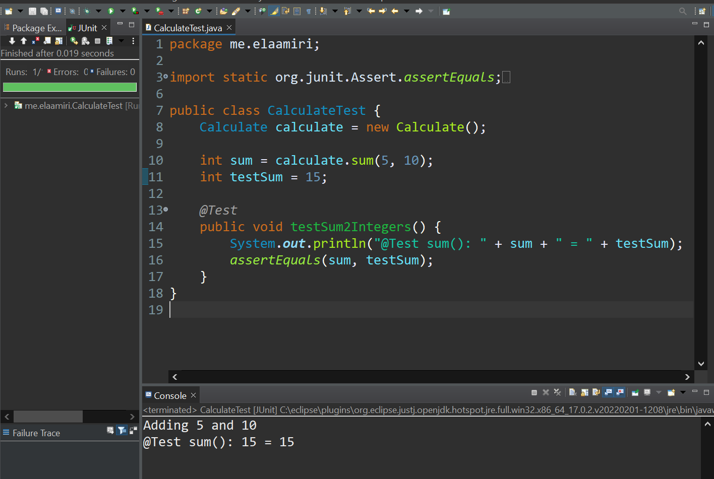
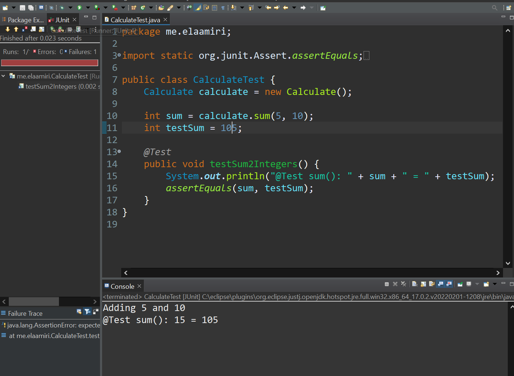
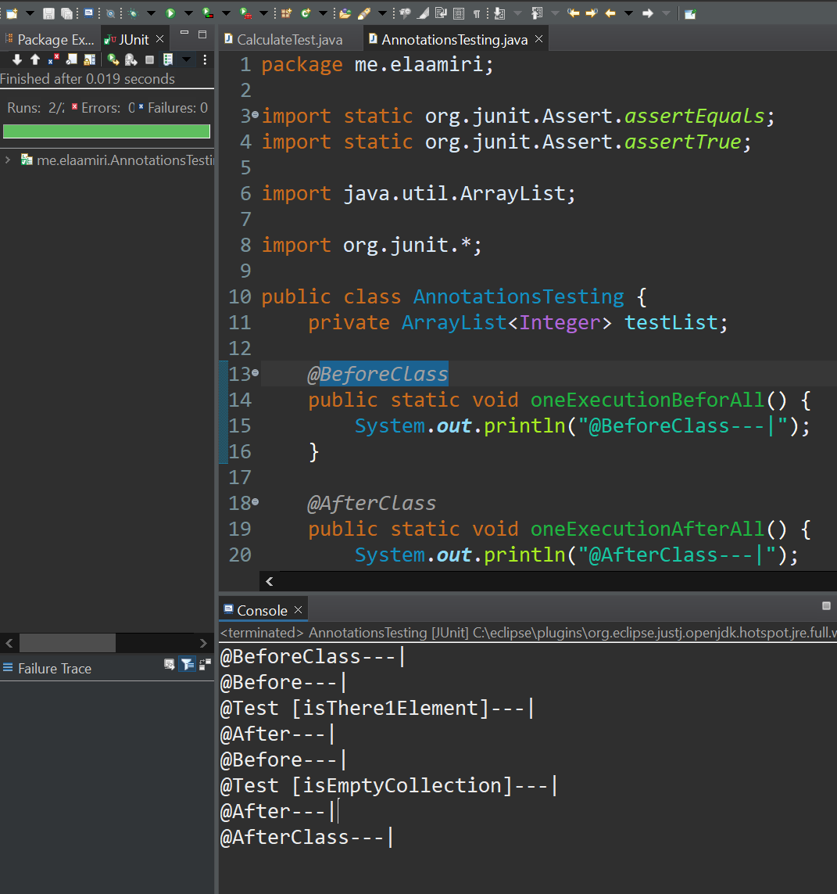
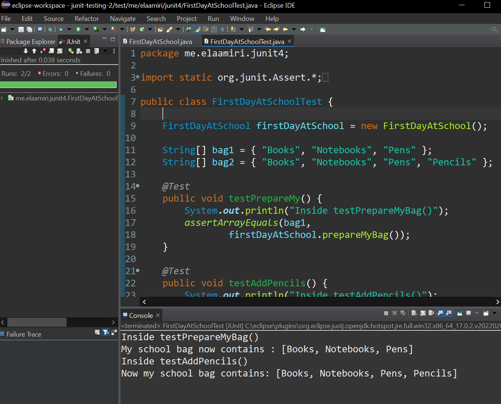
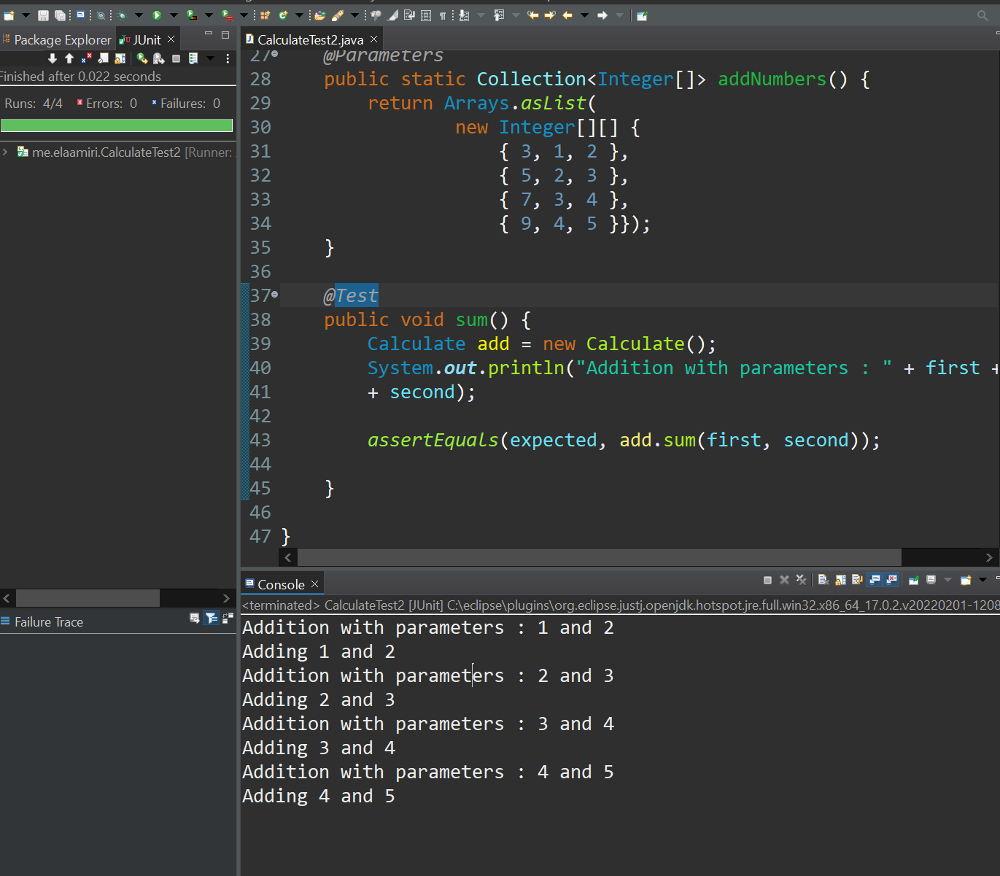
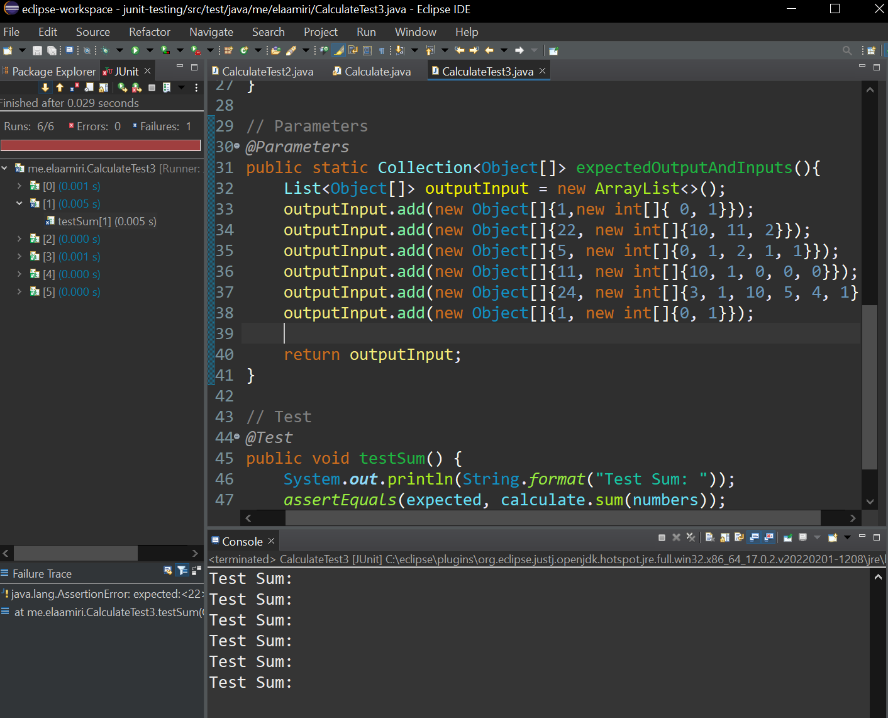

# JUNIT Guide

<!-- vscode-markdown-toc -->
* 1. [What is uint testing ?](#Whatisuinttesting)
* 2. [Unit testing in Java](#UnittestinginJava)
* 3. [JUnit first test](#JUnitfirsttest)
	* 3.1. [Setup Junit 5 in a Maven project with Eclipse](#SetupJunit5inaMavenprojectwithEclipse)
	* 3.2. [1 st Test](#stTest)
	* 3.3. [Junit Annotations](#JunitAnnotations)
	* 3.4. [JUnit Assertions](#JUnitAssertions)
* 4. [Initializing the project](#Initializingtheproject)
* 5. [Creating Java class to be tested](#CreatingJavaclasstobetested)
* 6. [Create and run JUint test case](#CreateandrunJUinttestcase)
* 7. [Using @Ignore annotation](#UsingIgnoreannotation)
* 8. [Creating Suite Tests](#CreatingSuiteTests)
* 9. [Creating parameterized tests](#Creatingparameterizedtests)
* 10. [Rules](#Rules)
* 11. [Categories](#Categories)

<!-- vscode-markdown-toc-config
	numbering=true
	autoSave=true
	/vscode-markdown-toc-config -->
<!-- /vscode-markdown-toc --> 


# Intoduction 
##  1. <a name='Whatisuinttesting'></a>What is uint testing ?
- A Unit can be a function, a class, apackage, or a subsystem.
- The term unit testing, refers to the practice od testing such small unit of our code.
- to ensure that they work as axpected.

##  2. <a name='UnittestinginJava'></a>Unit testing in Java
- The most popular testing framework in Java is [JUnit](https://junit.org/junit5/), wich we will cover in this guide.
- Another popular testing framework in Java is TestNG.

# JUnit
- JUnit is an open source testing framework which is used to write and run repeatable automated tests.
- JUnit is widely used in industry and can be used as stand alone Java program (from the command
line) or within an IDE such as Eclipse.
- JUnit provides:
    - **Assertions** for testing expected results.
    - **Test features** for sharing common test data.
    - **Test suites** for easily organizing and running tests.
    - Graphical and textual test runners.
- JUnit is used to test:
    - an entire object
    - part of an object - a method or some interacting methods
    - interaction between several objects

- Website : https://junit.org/junit5/ 
- user guide: https://junit.org/junit5/docs/current/user-guide/

> **JUnit 5** = **jUnit Platform** + **jUnit Jubiter** + **jUnit Vintage** 
> - **jUnit Platform**: serves as a foundation for launching testing frameworks on the JVM. It also 
> defines the TestEngine API for developing a testing framework that runs on the platform. 
> - **jUnit Jubiter**: is the combination of the programming model and extension model for writing
> tests and extensions in JUnit 5. (Annotations ...)
> - **jUnit Vintage**: provides a TestEngine for running JUnit 3 and JUnit 4 based tests on the 
> platform. It requires JUnit 4.12 or later to be present on the class path or module path.

##  3. <a name='JUnitfirsttest'></a>JUnit first test

- We have created an Eclipse Maven project 

###  3.1. <a name='SetupJunit5inaMavenprojectwithEclipse'></a>Setup Junit 5 in a Maven project with Eclipse

- To use JUnit 5 we should :
1. Include the dependency:

```xml
<dependency>
    <groupId>org.junit.jupiter</groupId>
    <artifactId>junit-jupiter-api</artifactId>
    <version>5.9.1</version>
    <scope>test</scope>
</dependency>
```
2. Add the `maven-compiler-plugin`

```xml
<build>
		<plugins>
			<plugin>
				<groupId>org.apache.maven.plugins</groupId>
				<artifactId>maven-compiler-plugin</artifactId>
				<version>3.8.1</version>
				<configuration>
					<source>17</source>
					<target>17</target>
				</configuration>
			</plugin>
            <plugin>
                <groupId>org.apache.maven.plugins</groupId>
                <artifactId>maven-surefire-plugin</artifactId>
                <version>3.0.0-M7</version>
            </plugin>
		</plugins>
	</build>
```
- The compiler plugin is used to compile the source code of a Maven project. This plugin has two 
goals, which are already bound to specific phases of the default lifecycle:
- compile – compile main source files
-  testCompile – compile test source files

- **REF**: https://maven.apache.org/surefire/maven-surefire-plugin/examples/junit-platform.html

- To use JUnit 4 we should :
- I just added the Junit 4 to the class path 

> Eclipse supports both JUnit 4 and JUnit 5 (JUnit Jupiter). You don’t have to download JUnit JAR 
> files as Eclipse is shipped with JUnit library.

- https://www.codejava.net/testing/junit-tutorial-for-beginner-with-eclipse

###  3.2. <a name='stTest'></a>1 st Test

- Here is the class we will test in this our first step:

```java
public class Calculate {
	
	public int sum(int var1, int var2) {
		System.out.println(String.format("Adding %d and %d", var1, var2));
		return var1+var2;
	}
}
```
- Here is the Testing class

```java
import static org.junit.Assert.assertEquals;

import org.junit.Test;

public class CalculateTest {
	Calculate calculate = new Calculate();
	
	int sum = calculate.sum(5, 10);
	int testSum = 15;
	
	@Test
	public void testSum2Integers() {
		System.out.println("@Test sum(): " + sum + " = " + testSum);
		assertEquals(testSum, sum);
	}
}

```
- Result when run this class :



- **Let's explain this** :
- `@Test` annotation above the testSum() method indicates that can be run as a test case.
- The testSum() method is the method that will test the sum() public method.
- The method `assertEquals ([String message], object expected, object actual)` takes
as inputs two objects and asserts that the two objects are equal.
- We run the project (`RUN Button`) or (`Right click` + `Run as JUnit test`).
- To see the actual result of a JUnit test, Eclipse IDE provides a JUnit window which shows the 
results of the tests. In this case where the test succeeds, the JUnit window does not show any 
errors or failures, as we can see in the image above.

- In case of not equal 



###  3.3. <a name='JunitAnnotations'></a>Junit Annotations 

- Basic annotations supported in Junit 4.

|Annotation|Desc|In 2 Words|
|--|--|--|
|`@Test public void method()`|indicates that the public void method to which it is attached can be run as a test case|**This method is a test**|
|`@Before public void method()`|indicates that this method must be executed **before each test** in the class, so as to execute some preconditions necessary for the test|**Execute this method before every test**|
|`@BeforeClass public static void method()`| indicates that the static method to which is attached must be executed **once** and before all tests in the class. That happens when the test methods share computationally expensive setup (e.g.connect to database).|**Execute this method before all tests once**|
|`@After public void method()`|indicates that this method gets executed after execution of each test (e.g. reset some variables after execution of every test, delete temporary variables etc)| **Execute this method after every test**|
|`@AfterClass public static void method()`|can be used when a method needs to be executed after executing all the tests in a JUnit Test Case class so as to clean-up the expensive set-up (e.g disconnect from a database). Attention: The method attached with this annotation (similar to BeforeClass) must be defined as static.|**Execute this method after all tests**|
|`@Ignore public static void method()`|can be used when you want temporarily disable the execution of a specific test. Every method that is annotated with @Ignore won’t be executed.|**do not run this method**|

- Lets test some of them 

```java
public class AnnotationsTesting {
	private ArrayList<Integer> testList;
	
	@BeforeClass
	public static void oneExecutionBeforAll() {
		System.out.println("@BeforeClass---|");
	}
	
	@AfterClass
	public static void oneExecutionAfterAll() {
		System.out.println("@AfterClass---|");
	}
	
	@Before
	public void anExecutionBeforeEach() {
		testList = new ArrayList<>();
		System.out.println("@Before---|");
	}
	
	@After
	public void anExecutionAfterEach() {
		testList.clear();
		System.out.println("@After---|");
	}
	
	@Test
	public void isEmptyCollection() {
		assertTrue(testList.isEmpty());
		testList.add(115); // this will be removed because the list 
		// cleared after each test
		System.out.println("@Test [isEmptyCollection]---|");
	}
	
	@Test
	public void isThere1Element() {
		testList.add(115);
		assertEquals(1, testList.size());
		
		System.out.println("@Test [isThere1Element]---|");
	}
	
	@Ignore
	public void ignoredExecution() {
		System.out.println("@Ignore: This execution is ignored");

	}
		
}
```

- Result :




###  3.4. <a name='JUnitAssertions'></a>JUnit Assertions 

- All `assertX()` methods are provided by the `Assert` class which
extends the class java.lang.Object and they are useful for writing 
tests so as to detect failures.

- Here are some of them :
- **REF**: https://junit.org/junit4/javadoc/latest/org/junit/Assert.html


* `void assertEquals([String message],expected value, actual value)`
<pre>
Asserts that two values are equal. Values might be type of
int, short, long, byte, char or java.lang.Object. The first
argument is an optional String message.
</pre>

* `void assertTrue([String message],boolean condition)`
<pre>
Asserts that a condition is true.
</pre>

* `void assertFalse([String message],boolean condition)`
<pre>
Asserts that a condition is false.
</pre>

* `void assertNotNull([String message], java.lang.Object object)`
<pre>
Asserts that an object is not null.
</pre>

* `void assertNull([String message], java.lang.Object object)`
<pre>
Asserts that an object is null.
</pre>

* `void assertSame([String message], java.lang.Object expected, java.lang.Object actual)`
<pre>
Asserts that the two objects refer to the same object.
</pre>


* `void assertNotSame([String message], java.lang.Object expected, java.lang.Object actual)`
<pre>
Asserts that the two objects do not refer to the same object.
</pre>


* `void assertArrayEquals([String message], expectedArray, resultArray)`
<pre>
Asserts that the array expected and the resulted array are
equal. The type of Array might be int, long, short, char,
byte or java.lang.Object
</pre>

- Lets test some of them 

```java
public class AssertionsTesting {
	@Test
	public void testAssertions() {
		String obj1 = "HelloWorld";
		String obj1_cpy = obj1;
		String obj2 = "HelloWorld";
		
		int var1 = 1;
		int var2 = 2;
		
		int [] digitsList1 = {1, 2, 3};
		int [] digitsList2 = {1, 2, 3};
		
		assertTrue(String.format("Assert True: %d == %d",var1, var2), var1+1==var2);
		assertEquals(obj1, obj2);
		assertSame(obj1, obj2);
		assertFalse(!obj1.startsWith(obj2));
//assertNull(var1);
		assertNotNull(var1);
		assertArrayEquals(digitsList1, digitsList2);
		assertNotSame(var1, var2);
		
		// All tests passed
	}
	
}

```
- The result : **All test passed**.


# Junit practical activity in core JavaSE App using Eclipse

##  4. <a name='Initializingtheproject'></a>Initializing the project

1. Create a new Eclipse project `juint-test-2`.
2. Create package `me.elaamiri.junit4` under `src`: for our app classes .
3. Create a new Source foler `test` for for our test classes `Click+New Source Folder`.
4. Create package `me.elaamiri.junit4` under `test`: for our app classes .

##  5. <a name='CreatingJavaclasstobetested'></a>Creating Java class to be tested 

- Here ou FirstDayAtSchool class which we will test after:

```java
package me.elaamiri.junit4;

import java.util.Arrays;

public class FirstDayAtSchool {
	public String[] prepareMyBag(){
		String[] schoolBag = {"Books", "Notebooks", "Pens"};
		System.out.println("My school bag now contains : "
				+ Arrays.toString(schoolBag));
		
		return schoolBag;
	}
	
	public String[] addPancils() {
		String[] schoolbag = { "Books", "Notebooks", "Pens", "Pencils" };
		System.out.println("Now my school bag contains: "
		+ Arrays.toString(schoolbag));
		return schoolbag;
	}
}

```

##  6. <a name='CreateandrunJUinttestcase'></a>Create and run JUint test case 

- To create a JUnit test case for the existing class `FirstDayAtSchool.java`.
1. Right-click on it in the Package Explorer view
2. Select New > JUnit Test Case. 
3. Change the source folder so that the class will be located to test source folder and ensure
that the flag New JUnit4 test is selected.
4. Click Finish. If the project does not contain the JUnit library in its classpath, it will ask 
you to add the JUnit library to the classpath.

- Below, there is the code of the class named FirstDayAtSchoolTest.java, which is our test class:

```java
package me.elaamiri.junit4;
import static org.junit.Assert.*;
import org.junit.Test;

public class FirstDayAtSchoolTest {
	
	FirstDayAtSchool firstDayAtSchool = new FirstDayAtSchool();
	
	String[] bag1 = { "Books", "Notebooks", "Pens" };
	String[] bag2 = { "Books", "Notebooks", "Pens", "Pencils" };
	
	@Test
	public void testPrepareMy() {
		System.out.println("Inside testPrepareMyBag()");
		assertArrayEquals(bag1, 
				firstDayAtSchool.prepareMyBag());
	}
	
	@Test
	public void testAddPencils() {
		System.out.println("Inside testAddPencils()");
		assertArrayEquals(bag2, 
				firstDayAtSchool.addPancils());
	}

}

```
- Run the test case by right-clicking on the test class and select Run As > JUnit Test.
- The output:




- Else, if we change one of the arrays, so that it contains a different element than the expected.
- :fire: and we run again the test class, the JUnit view will contain once again a failure.


##  7. <a name='UsingIgnoreannotation'></a>Using @Ignore annotation

- In the test class FirstDayAtSchoolTest we will add the `@Ignore` annotation to the `testAddPencils()` method. 
- In that way, we expect that this testing method will be
ignored and won’t be executed.

```java
@Ignore
@Test
public void testAddPencils() {
	System.out.println("Inside testAddPencils()");
	assertArrayEquals(bag2, school.addPencils());
}
```

- We can annotate the whole class also. :fire:, 
- In this case The whole test class won’t be executed, so no result will be displayed int the console output and in the junit view.

```java
@Ignore
public class FirstDayAtSchoolTest {
	// Tests code ....
}
```


##  8. <a name='CreatingSuiteTests'></a>Creating Suite Tests

- A test suite is a __collection__ of some test cases from different classes that can
be run all together using `@RunWith` and `@Suite` annotations. 

- :fire: Very helpful if we have many test classes and you want
to run them all together instead of running each test one at a time.

- When a class is annotated with `@RunWith`, JUnit will invoke the class in which is annotated so as to run the tests, instead of using the runner built into JUnit.


- Based on our previous class, we can create two test classes. 
- The one class will test the public method `prepareMyBag()` and the other test class will test the method `addPencils()`.

- Voilà, :smile:, here are our classes.

- `PrepareMyBagTest.java`

```java
package me.elaamiri.junit4;

import static org.junit.Assert.assertArrayEquals;

import org.junit.Test;

public class PrepareMyBagTest {
	FirstDayAtSchool school = new FirstDayAtSchool();
	String[] bag = { "Books", "Notebooks", "Pens" };
	@Test
	public void testPrepareMyBag() {
		System.out.println("Inside testPrepareMyBag()");
		assertArrayEquals(bag, school.prepareMyBag());
	}
}

```

- `PrepareMyBagTest.java`

```java
package me.elaamiri.junit4;

import static org.junit.Assert.assertArrayEquals;

import org.junit.Test;

public class PrepareMyBagTest {
	FirstDayAtSchool school = new FirstDayAtSchool();
	String[] bag = { "Books", "Notebooks", "Pens" };
	@Test
	public void testPrepareMyBag() {
		System.out.println("Inside testPrepareMyBag()");
		assertArrayEquals(bag, school.prepareMyBag());
	}
}
```

- Now we will create a test suite so as to run the above classes together. 
- Create a new java class named `SuiteTest.java` :

```java
package me.elaamiri.junit4;

import org.junit.runner.RunWith;
import org.junit.runners.Suite;

@RunWith(Suite.class)
@Suite.SuiteClasses({PrepareMyBagTest.class, AddPencilsTest.class})
public class SuiteTest {
	
}
```
- With the `@Suite.SuiteClasses` annotation we can define which test classes will be included in the execution.

- When we run this Suite, all the testes included will run.


##  9. <a name='Creatingparameterizedtests'></a>Creating parameterized tests

- How to create parameterized tests ? => That what we will do in this section. :smile:
- BUT, When a test class can be considered as a **parameterized** test class ?
- Of course, when it fullfills all the following requirements:
	1. **The class is annotated with @RunWith(Parameterized.class)**
	As explained in the previous section, `@RunWith`annotation enables JUnit to invoke the class 
	in which is annotated to run the tests, instead of using the runner built into JUnit.
	`Parameterized` is a runner inside JUnit that will run the same test case with different set of inputs.
	2. **The class has a single constructor that stores the test data.**
	3. **The class has a static method that generates and returns test data and is annotated with the @Parameters annotation.**
	4. **The class has a test, which obviously means that it needs a method annotated with the @Test annotation.**

- Now, we will create a new test class named `CalculateTest2.java`, which will follow the guidelines mentioned above.

```java
package me.elaamiri;

import static org.junit.Assert.assertEquals;

import java.util.Arrays;
import java.util.Collection;

import org.junit.runner.RunWith;
import org.junit.runners.Parameterized;
import org.junit.runners.Parameterized.Parameters;

@RunWith(Parameterized.class)
public class CalculateTest2 {
	private int expected;
	private int first;
	private int second;
	
	public CalculateTest2(int expected,
			int first,
			int second) {
		this.expected = expected;
		this.first = first;
		this.second = second;
	}
	
	@Parameters
	public static Collection<Integer[]> addNumbers() {
		return Arrays.asList(
				new Integer[][] { 
					{ 3, 1, 2 }, 
					{ 5, 2, 3 },
					{ 7, 3, 4 }, 
					{ 9, 4, 5 }});
	}
	
	@Test
	public void sum() {
		Calculate add = new Calculate();
		System.out.println("Addition with parameters : " + first + " and "
		+ second);
		
		assertEquals(expected, add.sum(first, second));

	}
	
}

```

- **What is that ?**

- As we can observe in the class above, it fullfills all the above requirements. 
- The method `addedNumbers` annotated with `@Parameters` returns a Collection of Arrays. 
- Each array includes the inputs/output numbers of each test execution. 
- The number of elements in each array must be the same with the number of parameters in the constructor. 
- So, in this specific case, each array includes three elements, two elements that represent the numbers to be added and one element for the result.

- :fire:OUTPUT:fire:



- As we see in the output, the test case is executed four times, which is the number of inputs in the method annotated with `@Parameters` annotation


```diff
- org.junit.runners.model.InvalidTestClassError: Invalid test class 'me.elaamiri.CalculateTest2':
  1. No runnable methods
```
- This exceptions will appears if we did not specify the `@Test` mehod.

- **Example 2**:
- Testing the second `sum(int...numbers)` function.

```java
package me.elaamiri;
import java.util.Arrays;

public class Calculate {
	
	public int sum(int var1, int var2) {
		System.out.println(String.format("Adding %d and %d", var1, var2));
		return var1+var2;
	}
	
	public int sum(int... numbers) {
		return Arrays.stream(numbers).sum();
	}

}

```

- Here is our test class 

```java
package me.elaamiri;
import static org.junit.Assert.assertEquals;
import java.util.ArrayList;
import java.util.Collection;
import java.util.List;
import org.junit.Test;
import org.junit.runner.RunWith;
import org.junit.runners.Parameterized;
import org.junit.runners.Parameterized.Parameters;

@RunWith(Parameterized.class)
public class CalculateTest3 {
	
	Calculate calculate = new Calculate();
	
	private int expected;
	private int[] numbers;
	
	//constructor
	public CalculateTest3(int expected, int... numbers) {
		this.expected = expected;
		this.numbers = numbers;
		
	}
	
	// Parameters
	@Parameters
	public static Collection<Object[]> expectedOutputAndInputs(){
		List<Object[]> outputInput = new ArrayList<>();
		outputInput.add(new Object[]{1,new int[]{ 0, 1}});
		outputInput.add(new Object[]{22, new int[]{10, 11, 2}});
		outputInput.add(new Object[]{5, new int[]{0, 1, 2, 1, 1}});
		outputInput.add(new Object[]{11, new int[]{10, 1, 0, 0, 0}});
		outputInput.add(new Object[]{24, new int[]{3, 1, 10, 5, 4, 1}});
		outputInput.add(new Object[]{1, new int[]{0, 1}});
		
		return outputInput;
	}
	
	// Test
	@Test 
	public void testSum() {
		System.out.println(String.format("Test Sum: "));
		assertEquals(expected, calculate.sum(numbers));
	}
}

```

- Result :



- **Note** that the test `1` of `22 as expected ans (10, 11, 2) is Failed`.

- **Example 3**:
- Let's run the `CalculateTest`, `CalculateTest2` and `CalculateTest3` in the same time with `Suite`.

```java
package me.elaamiri;
import org.junit.runner.RunWith;
import org.junit.runners.Suite;
import org.junit.runners.Suite.SuiteClasses;
@RunWith(Suite.class)
@Suite.SuiteClasses({CalculateTest.class, CalculateTest2.class, CalculateTest3.class})
public class CalculateTestSuite {

}

```
- That runs the 3 test classes.


##  10. <a name='Rules'></a>Rules 

- Allows very flexible addition or redefinition of the behavior of each test method in a test class.
- `@Rule` annotation should be used so as to mark public fields of a test class. 
- Those fields should be of type `MethodRule`.
- `MethodRule` is an alteration in how a test method is run and reported.
- Multiple `MethodRules` can be applied to a test method.
- `MethodRule` interface has a lot of implementations:
1. `ErrorCollector` which allows execution of a test to continue after the first problem is found.
2. `ExpectedException` which allows in-test specification of expected exception types and messages.
3.  `TestName` which makes the current test name available inside test methods.

- Except for those already defined rules, we can create our own custom rules and use them in our test cases as we wish.

- Let's use `TestName` in our Test.
- :fire:`TestName` is invoked when a test is about to start.
- Here is our `TestNameRuleTest.java`.
```java
package me.elaamiri;

import static org.junit.Assert.assertEquals;

import org.junit.Rule;
import org.junit.Test;
import org.junit.rules.MethodRule;
import org.junit.rules.TestName;

public class TestNameRuleTest {
	
	//@Rule
	//public MethodRule name = (MethodRule) new TestName();
	/*
	 java.lang.ClassCastException: 
	 class org.junit.rules.TestName cannot be cast to class 
	 org.junit.rules.MethodRule (org.junit.rules.TestName 
	 and org.junit.rules.MethodRule are in unnamed module 
	 of loader 'app')
	
	 */
	@Rule
	public TestName name1 =  new TestName();
	
	@Test
	public void testA() {
		System.out.println(name1.getMethodName());
		assertEquals("testA", name1.getMethodName());
	}
	
	@Test
	public void testB() {
		System.out.println(name1.getMethodName());
		assertEquals("testB", name1.getMethodName());
	}

}

```

- OUTPUT:

<pre>
testA
testB
</pre>

> We can see that the @Rule annotation marks the public field name which is of type MethodRule 
> and specifically, TestName type. Then, we can use in our tests this name field and find for 
> example the name of the test method, in this specific case.

- **MORE INFO**:

Junit Rules work on the principle of AOP (aspect oriented programming). It intercepts the test 
method thus providing an opportunity to do some stuff before or after the execution of a particular test method. 

- Take the example of the below code:

```java
public class JunitRuleTest {

  @Rule
  public TemporaryFolder tempFolder = new TemporaryFolder();

  @Test
  public void testRule() throws IOException {
    File newFolder = tempFolder.newFolder("Temp Folder");
    assertTrue(newFolder.exists());
  }
} 

```

- Every time the above test method is executed, a temporary folder is created and it gets deleted 
after the execution of the method. This is an example of an out-of-box rule provided by Junit.

- Similar behaviour can also be achieved by creating our own rules. Junit provides the TestRule 
interface, which can be implemented to create our own Junit Rule.

- Useful link: https://www.codeaffine.com/2012/09/24/junit-rules/ 

> JUnit 4 rules provide a flexible mechanism to enhance tests by running some code around a test 
> case execution. In some sense, it’s similar to having @Before and @After annotations in our test class.

- https://www.baeldung.com/junit-4-rules 


##  11. <a name='Categories'></a>Categories

# Run Junit tests from command line 

# Junit 5 practical activity with Springboot.

During our practical activity we will work on this use case :


- **Note**: The library [`AssertJ`](https://assertj.github.io/doc/) is a Java library that 
provides a rich set of assertions and truly helpful error messages, improves test code 
readability, and is designed to be super easy to use within your favorite IDE.

```xml
<dependency>
  <groupId>org.assertj</groupId>
  <artifactId>assertj-core</artifactId>
  <!-- use 2.9.1 for Java 7 projects -->
  <version>3.23.1</version>
  <scope>test</scope>
</dependency>

```