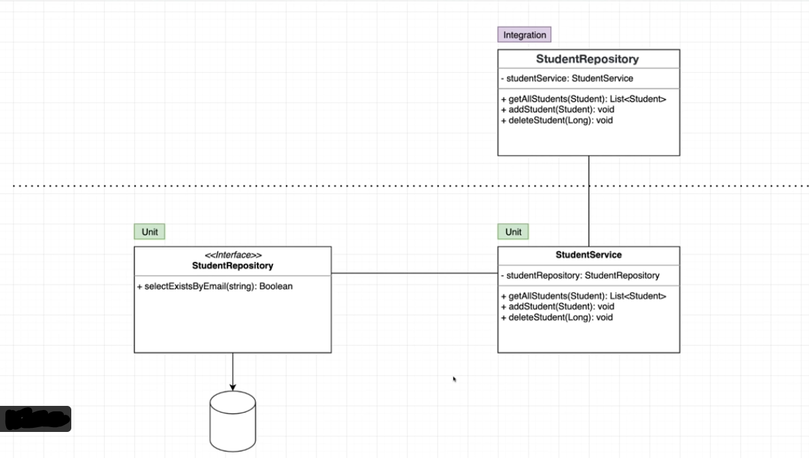

# JUNIT Guide 


# Intoduction 
## What is uint testing ?
- A Unit can be a function, a class, apackage, or a subsystem.
- The term unit testing, refers to the practice od testing such small unit of our code.
- to ensure that they work as axpected.

## Unit testing in Java
- The most popular testing framework in Java is [JUnit](https://junit.org/junit5/), wich we will cover in this guide.
- Another popular testing framework in Java is TestNG.

# JUnit
- JUnit is an open source testing framework which is used to write and run repeatable automated tests.
- JUnit is widely used in industry and can be used as stand alone Java program (from the command
line) or within an IDE such as Eclipse.
- JUnit provides:
    - **Assertions** for testing expected results.
    - **Test features** for sharing common test data.
    - **Test suites** for easily organizing and running tests.
    - Graphical and textual test runners.
- JUnit is used to test:
    - an entire object
    - part of an object - a method or some interacting methods
    - interaction between several objects

- Website : https://junit.org/junit5/ 
- user guide: https://junit.org/junit5/docs/current/user-guide/

> **JUnit 5** = **jUnit Platform** + **jUnit Jubiter** + **jUnit Vintage** 
> - **jUnit Platform**: serves as a foundation for launching testing frameworks on the JVM. It also 
> defines the TestEngine API for developing a testing framework that runs on the platform. 
> - **jUnit Jubiter**: is the combination of the programming model and extension model for writing
> tests and extensions in JUnit 5. (Annotations ...)
> - **jUnit Vintage**: provides a TestEngine for running JUnit 3 and JUnit 4 based tests on the 
> platform. It requires JUnit 4.12 or later to be present on the class path or module path.

## JUnit first test

- We have created an Eclipse project 
- Here is the class we will test in this our first step:

```java

```


# Junit practical activity with Springboot.

During our practical activity we will work on this use case :



- **Note**: The library [`AssertJ`](https://assertj.github.io/doc/) is a Java library that 
provides a rich set of assertions and truly helpful error messages, improves test code 
readability, and is designed to be super easy to use within your favorite IDE.

```xml
<dependency>
  <groupId>org.assertj</groupId>
  <artifactId>assertj-core</artifactId>
  <!-- use 2.9.1 for Java 7 projects -->
  <version>3.23.1</version>
  <scope>test</scope>
</dependency>

```